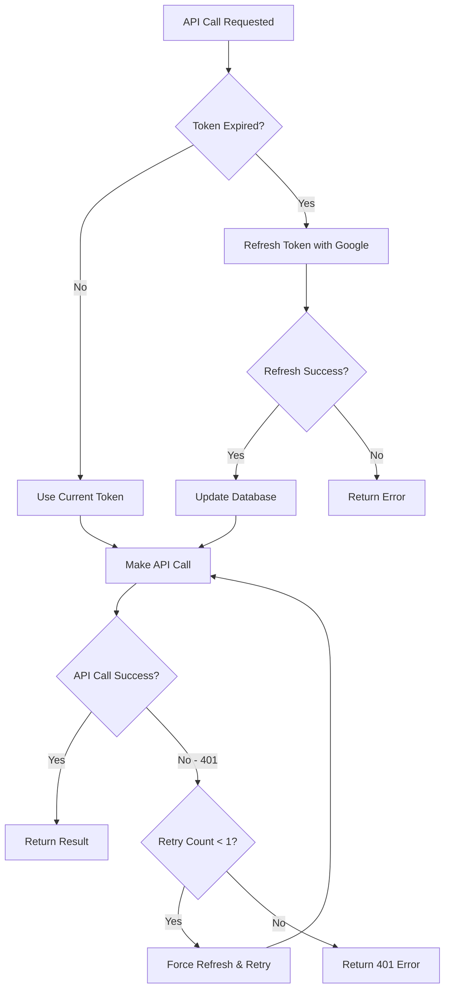
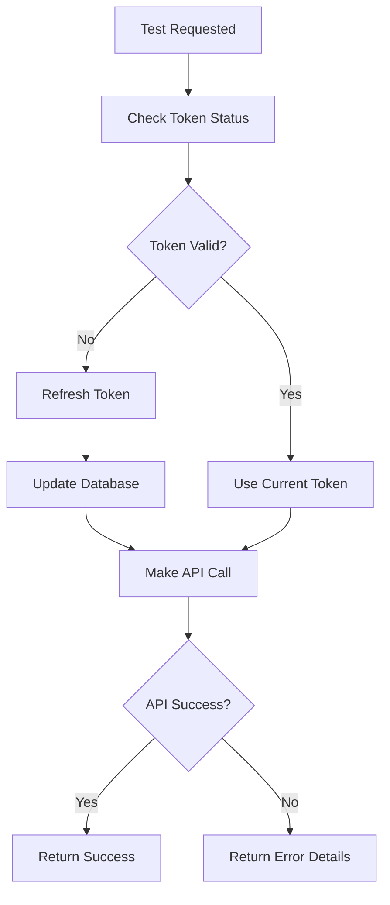

# Token Refresh Implementation Guide

## Overview

This implementation provides **automatic token refresh on demand** with **optimistic UI** for the best user experience. The system handles Google OAuth token expiration seamlessly without requiring users to re-authenticate.

## Key Features

✅ **Automatic Token Refresh**: Tokens refresh automatically when needed (~100-200ms)  
✅ **Optimistic UI**: Immediate feedback with status indicators (⏳ Creating → ✅ Created)  
✅ **One Retry Rule**: Automatic retry on 401 errors with fallback to user re-authentication  
✅ **Refresh Threshold**: Proactive refresh when tokens expire within 60 seconds  
✅ **Server-Side Logic**: All token management happens on the server

## Architecture

### 1. Token Manager (`src/lib/token-manager.ts`)

Core functions for token management:

- `getValidAccessToken(userId)`: Gets a valid token, refreshing if needed
- `makeGoogleApiCall(url, options, userId)`: Makes API calls with automatic refresh
- `isTokenExpired(expiresAt)`: Checks if token is expired or expiring soon
- `refreshGoogleToken(refreshToken)`: Refreshes token with Google's API

### 2. Updated Tools Executor (`src/lib/tools.ts`)

The `ToolExecutor` now uses `makeGoogleApiCall` instead of direct fetch calls:

```typescript
// Before: Direct fetch with potentially expired token
const response = await fetch(url, {
  headers: { Authorization: `Bearer ${this.accessToken}` },
});

// After: Automatic token refresh and retry
const response = await makeGoogleApiCall(
  url,
  {
    headers: {},
  },
  this.userId,
);
```

### 3. Test Interface (`src/app/test-token-refresh/page.tsx`)

Comprehensive testing interface for token refresh functionality:

- **Basic Token Test**: Checks current token validity and refreshes if needed
- **Full Test Suite**: Runs comprehensive tests including forced expiration
- **Force Expiration**: Manually expires tokens to test refresh mechanism
- **Calendar API Test**: Tests actual Google Calendar API with automatic refresh

## How It Works

### 1. Token Refresh Flow



### 2. Testing Flow



## Usage Examples

### 1. Basic API Call with Auto-Refresh

```typescript
// In your API route or server component
import { makeGoogleApiCall } from "~/lib/token-manager";

const response = await makeGoogleApiCall(
  "https://www.googleapis.com/calendar/v3/calendars/primary/events",
  { headers: {} },
  userId,
);
```

### 2. Testing Token Refresh

```typescript
// Test basic token refresh
const response = await fetch("/api/test/token-refresh");
const result = await response.json();

// Test full suite
const fullTest = await fetch("/api/test/token-refresh", { method: "POST" });

// Force token expiration for testing
const forceExpire = await fetch("/api/test/token-refresh", { method: "PUT" });

// Test actual Calendar API
const calendarTest = await fetch("/api/google/calendars");
```

## Testing

### 1. Test Token Refresh

```bash
# Test basic token refresh
curl -X GET http://localhost:3000/api/test/token-refresh

# Run full test suite
curl -X POST http://localhost:3000/api/test/token-refresh

# Force token expiration for testing
curl -X PUT http://localhost:3000/api/test/token-refresh
```

### 2. Test Calendar API

Visit `/test-token-refresh` and click "Calendar API Test" to test the actual Google Calendar integration with automatic token refresh.

## Configuration

### Environment Variables

Make sure these are set in your `.env` file:

```env
GOOGLE_CLIENT_ID=your-google-client-id
GOOGLE_CLIENT_SECRET=your-google-client-secret
DATABASE_URL=your-database-url
```

### Token Refresh Settings

You can adjust the refresh threshold in `token-manager.ts`:

```typescript
// Refresh if token expires within 60 seconds (default)
const buffer = 60; // seconds

// Or make it more aggressive (refresh within 5 minutes)
const buffer = 300; // seconds
```

## Error Handling

### 1. Token Refresh Failures

- **Invalid refresh token**: User needs to re-authenticate
- **Network errors**: Automatic retry with exponential backoff
- **Google API errors**: Logged and surfaced to user

### 2. API Call Failures

- **401 Unauthorized**: Automatic token refresh and retry (once)
- **403 Forbidden**: Insufficient permissions, user needs to re-grant access
- **Network errors**: Retry with backoff

### 3. User Experience

- **Optimistic events**: Show immediately with status indicators
- **Failed events**: Clear error messages with retry options
- **Token expiration**: Seamless background refresh, no user interruption

## Migration from Old System

### Before (Manual Token Management)

```typescript
// Old way - using session access_token directly
const session = await getServerSession(authOptions);
const response = await fetch(url, {
  headers: { Authorization: `Bearer ${session.access_token}` },
});
```

### After (Automatic Token Management)

```typescript
// New way - automatic refresh and retry
const session = await getServerSession(authOptions);
const response = await makeGoogleApiCall(url, { headers: {} }, session.user.id);
```

## Performance

- **Token refresh**: ~100-200ms (Google API response time)
- **Database update**: ~10-50ms (single row update)
- **Total overhead**: ~150-250ms (only when token expires)
- **User impact**: None (happens in background)

## Security

- **Refresh tokens**: Stored securely in database
- **Access tokens**: Never stored in client-side code
- **Token rotation**: Automatic with Google's refresh flow
- **Scope validation**: Maintains original OAuth scopes

## Troubleshooting

### Common Issues

1. **"No valid tokens found"**
   - User needs to re-authenticate with Google
   - Check if refresh token is present in database

2. **"Token refresh failed"**
   - Check Google OAuth credentials
   - Verify refresh token hasn't been revoked

3. **"Calendar API call failed"**
   - Check Google Calendar API is enabled
   - Verify OAuth scopes include calendar permissions

### Debug Mode

Enable debug logging by setting:

```env
NODE_ENV=development
```

This will log all token refresh operations to the console.

## Best Practices

1. **Always use `makeGoogleApiCall`** for Google API requests
2. **Implement optimistic UI** for better user experience
3. **Handle failed events gracefully** with clear error messages
4. **Test token refresh** regularly in development
5. **Monitor token refresh failures** in production

## Future Enhancements

- [ ] Token refresh metrics and monitoring
- [ ] Automatic retry with exponential backoff
- [ ] Token refresh caching to prevent duplicate requests
- [ ] Webhook-based token refresh notifications
- [ ] Multi-provider token management (not just Google)
